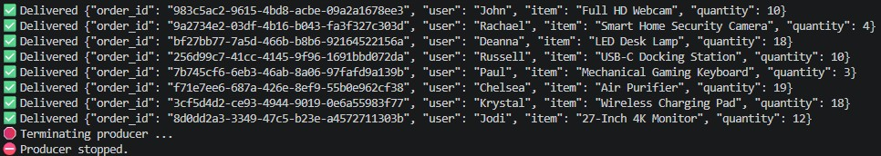
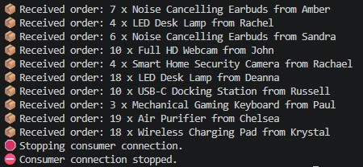

# Kafka Streaming Demo: Producer → Broker → Consumer

## Overview

This project demonstrates a simple event-driven streaming architecture using Apache Kafka.

The application simulates customer orders, publishes them to a Kafka topic using a producer, and processes them in real time using a consumer.

### Architecture

```text
+------------+      +---------------+      +------------+
|  Producer  | ---> | Kafka Broker  | ---> |  Consumer  |
+------------+      +---------------+      +------------+

 Generates           Stores and         Reads and
 fake orders         streams events     processes orders
```

## Features

* Generate realistic order events using Faker
* Publish events to a Kafka topic (`orders`)
* Consume and process events in real time
* Demonstrate asynchronous event streaming
* Simple implementation using the Confluent Kafka Python client

---

## Project Structure

```text
.
├── producer/producer.py
├── consumer/consumer.py
├── docker-compose.yaml
└── README.md
```

### producer.py

Responsible for:

* Generating fake order events
* Publishing messages to Kafka
* Reporting successful message delivery

Example event:

```json
{
  "order_id": "b9a52e88-6d56-4f6d-97c2-5b8f7a3f1f8d",
  "user": "John",
  "item": "Wireless Bluetooth Headphones",
  "quantity": 4
}
```

### consumer.py

Responsible for:

* Subscribing to the `orders` topic
* Polling Kafka for new messages
* Deserializing JSON payloads
* Displaying received orders

Example output:

```text
📦 Received order: 4 x Wireless Bluetooth Headphones from John
```

---

## Technologies Used

* Python 3.x
* Apache Kafka
* Confluent Kafka Python Client
* Faker
* Docker Compose

---

## Kafka Components

### Producer

The producer generates order events and sends them to the Kafka broker.

Responsibilities:

* Create event payloads
* Serialize data to JSON
* Publish events to Kafka topics

### Broker

Kafka acts as the message broker.

Responsibilities:

* Store events
* Manage topics
* Distribute messages to consumers

### Consumer

The consumer subscribes to the `orders` topic and processes incoming events.

Responsibilities:

* Read messages
* Deserialize event payloads
* Process business events

---

## Setup

### Prerequisites

* Docker
* Docker Compose
* Python 3.10+
* pip

---

### Start Kafka Infrastructure

```bash
docker compose up -d
```

Verify containers:

```bash
docker ps
```

---

### Install Python Dependencies

```bash
pip install confluent-kafka faker
```

---

### Start Consumer

Open a terminal and run:

```bash
python -m consumer.consumer
```

Expected output:

```text
🟢 Consumer is running and subscribed to orders topic ...
```

---

### Start Producer

Open another terminal and run:

```bash
python producer.producer
```

Expected output:



---

### Observe Streaming Data

Consumer terminal:



---

## Topic Information

Topic Name:

```text
orders
```

Message Format:

```json
{
  "order_id": "<uuid>",
  "user": "<customer>",
  "item": "<product>",
  "quantity": <integer>
}
```

---

## Learning Objectives

This project demonstrates:

* Event-driven architecture
* Real-time data streaming
* Kafka producers and consumers
* Topic-based messaging
* Message serialization using JSON
* Consumer groups and offsets
* Basic stream processing patterns

---

## Future Enhancements

Potential improvements include:

* Multiple Kafka consumers
* Partitioned topics
* Schema Registry integration
* Avro or Protobuf serialization
* Kafka Connect
* Debezium CDC integration
* Stream processing with Spark Structured Streaming
* Airflow orchestration
* Databricks ingestion pipelines
* Monitoring with Prometheus and Grafana

---

## Author

A simple Kafka streaming project demonstrating real-time event processing using Python, Apache Kafka, and Docker.
